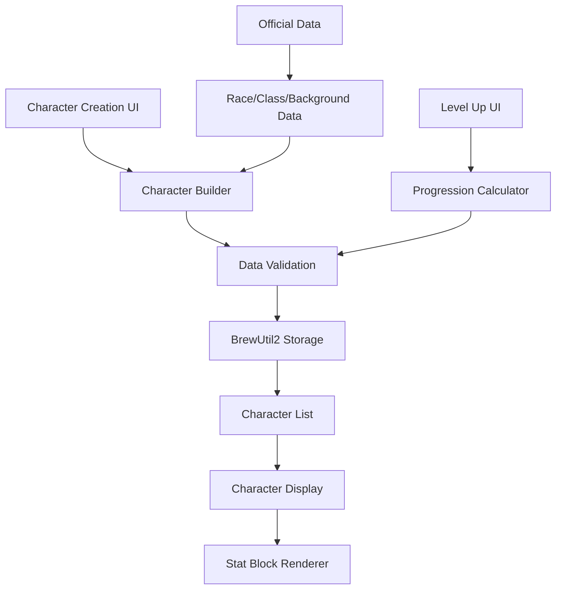

# Player Character System Design

## Overview

The Player Character System extends the existing 5etools architecture to provide comprehensive character management functionality. The system follows established patterns from the bestiary and other content pages, utilizing the existing data structures, UI components, and storage mechanisms while adding character-specific features for creation, progression, and gameplay support.

## Architecture

### Core Components

The system follows the established 5etools modular architecture:

1. **Data Layer**: Character data stored in homebrew-style JSON format using existing BrewUtil2 storage
2. **Page Layer**: New `characters.html` page following bestiary page patterns
3. **JavaScript Modules**:
   - `js/characters.js` - Main page controller
   - `js/render-characters.js` - Character rendering utilities
   - `js/filter-characters.js` - Character filtering system
   - `js/utils-characters.js` - Character management utilities
4. **CSS Layer**: `css/characters.css` extending existing stat block styles

### Data Flow



## Components and Interfaces

### Character Data Model

Characters are stored as JSON objects following this structure:

```javascript
{
  "name": "Character Name",
  "source": "HOMEBREW", // Always homebrew for player characters
  "level": 1,
  "race": {
    "name": "Human",
    "source": "PHB",
    "subrace": null // Optional
  },
  "class": {
    "name": "Fighter",
    "source": "PHB",
    "subclass": {
      "name": "Champion",
      "source": "PHB"
    }
  },
  "background": {
    "name": "Soldier",
    "source": "PHB"
  },
  "abilityScores": {
    "str": 15,
    "dex": 14,
    "con": 13,
    "int": 12,
    "wis": 10,
    "cha": 8
  },
  "hitPoints": {
    "max": 12,
    "current": 12,
    "temp": 0
  },
  "spellcasting": {
    "slots": {
      "1": {"max": 2, "used": 0},
      "2": {"max": 0, "used": 0}
      // ... up to level 9
    },
    "known": ["spell1", "spell2"],
    "prepared": ["spell1"]
  },
  "customNotes": "Campaign-specific notes",
  "customFeatures": [
    {
      "name": "Custom Feature",
      "description": "Custom feature description"
    }
  ],
  "_meta": {
    "created": "2024-01-01",
    "lastModified": "2024-01-02"
  }
}
```

### Character Builder Interface

The character creation interface provides step-by-step character building:

1. **Basic Information**: Name, level selection
2. **Race Selection**: Dropdown populated from `data/races.json`
3. **Class Selection**: Dropdown populated from class data files
4. **Background Selection**: Dropdown from `data/backgrounds.json`
5. **Ability Scores**: Point buy, standard array, or manual entry
6. **Equipment**: Starting equipment based on class/background
7. **Spells**: Spell selection for spellcasting classes

### Character Display Interface

Characters are displayed using adapted bestiary stat block format:

```html
<div class="character-statblock">
  <div class="character-header">
    <h1 class="character-name">Character Name</h1>
    <div class="character-meta">Level 5 Human Fighter</div>
  </div>

  <div class="character-stats">
    <!-- Ability scores with clickable dice rolls -->
  </div>

  <div class="character-features">
    <!-- Class features, racial traits, etc. -->
  </div>

  <div class="character-spells" style="display: none;">
    <!-- Spell section for spellcasters -->
  </div>

  <div class="character-custom">
    <!-- Custom notes and features -->
  </div>
</div>
```

### Level Up System

The level up system calculates progression automatically:

1. **Hit Points**: Prompts for rolled or average HP increase
2. **Class Features**: Automatically applies new features from class data
3. **Ability Score Improvements**: Prompts for ASI or feat selection at appropriate levels
4. **Spell Progression**: Updates spell slots and known spells
5. **Proficiency Bonus**: Automatically calculated based on level

### Dice Rolling Integration

Dice rolling uses the existing dice rolling infrastructure:

```javascript
// Ability check example
const rollResult = Renderer.dice.pRoll2(
  `1d20+${abilityModifier}`,
  {
    name: `${characterName} - ${abilityName} Check`,
    isUser: true
  }
);
```

## Data Models

### Character Storage

Characters are stored using the existing BrewUtil2 system:

- **Storage Key**: `CHARACTERS_HOMEBREW`
- **Format**: Standard homebrew JSON with character array
- **Persistence**: LocalStorage with export/import capabilities
- **Validation**: Uses existing homebrew validation patterns

### Integration with Official Data

The system references official data without duplicating it:

- **Races**: References `data/races.json` entries by name/source
- **Classes**: References class data files by name/source
- **Spells**: References spell data for spellcasting characters
- **Equipment**: References item data for equipment tracking

### Calculated Properties

Characters have computed properties similar to monsters:

```javascript
// Computed during character loading
character._proficiencyBonus = Math.ceil(character.level / 4) + 1;
character._abilityModifiers = {
  str: Math.floor((character.abilityScores.str - 10) / 2),
  // ... other abilities
};
character._savingThrows = {
  str: character._abilityModifiers.str + (character._proficiencies.saves.includes('str') ? character._proficiencyBonus : 0),
  // ... other saves
};
```

## Error Handling

### Data Validation

- **Character Creation**: Validates all required fields before saving
- **Level Up**: Ensures valid progression rules are followed
- **Spell Management**: Validates spell selections against class spell lists
- **Import/Export**: Validates JSON structure and handles missing references

### Graceful Degradation

- **Missing Official Data**: Shows placeholder text for missing race/class references
- **Corrupted Character Data**: Provides repair options or safe defaults
- **Storage Failures**: Falls back to session storage with user notification

### User Feedback

- **Loading States**: Shows progress indicators during data operations
- **Error Messages**: Clear, actionable error messages following 5etools patterns
- **Confirmation Dialogs**: Confirms destructive actions like character deletion

## Testing Strategy

### Unit Testing

- **Character Builder**: Test character creation with various race/class combinations
- **Level Up Logic**: Test progression calculations for all classes
- **Dice Rolling**: Test dice roll generation and modifier calculations
- **Data Validation**: Test import/export with valid and invalid data

### Integration Testing

- **UI Components**: Test character display rendering with various character types
- **Storage System**: Test character persistence and retrieval
- **Official Data Integration**: Test references to race/class/spell data
- **Filter System**: Test character filtering and search functionality

### User Acceptance Testing

- **Character Creation Flow**: Complete character creation from start to finish
- **Level Progression**: Level up characters through multiple levels
- **Spell Management**: Test spell slot tracking and spell selection
- **Custom Content**: Test custom notes and features functionality

### Performance Testing

- **Large Character Lists**: Test performance with 50+ characters
- **Complex Characters**: Test high-level characters with many features
- **Data Loading**: Test initial page load times with character data
- **Memory Usage**: Monitor memory usage during extended sessions

## Implementation Phases

### Phase 1: Core Infrastructure
- Character data model and storage
- Basic character creation interface
- Simple character display

### Phase 2: Official Content Integration
- Race/class/background integration
- Automatic feature application
- Basic spell support

### Phase 3: Advanced Features
- Level up system
- Dice rolling integration
- Custom content support

### Phase 4: Polish and Optimization
- UI refinements
- Performance optimization
- Comprehensive testing
